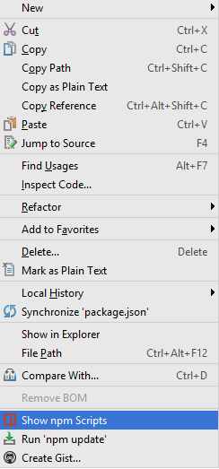
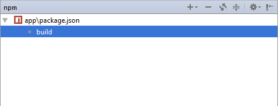
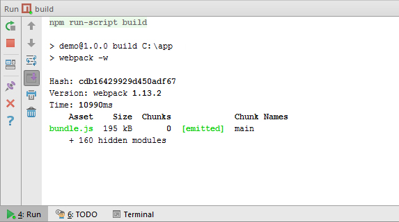

#интеграция webpack в WebStorm

## Установка webpack 

```
$ npm install webpack -g 
```  

## Конфигурация webpack 

* Конфигурационный файл webpack.config.js следует разместить в директории с приложением. 

## Интеграция Webpack в WebStorm IDE 

* Для интеграции Webpack в WebStorm добавьте следующий код в файл package.json (файл должен находиться в директории с приложением): 
```
 "scripts": {
    "build": "webpack -w"
  }
``` 

* Перейдите в пункт меню View, выберите опцию Tool Windows > Project 
* В открывшемся окне с каталогом папок приложения кликните правой кнопкой мыши по файлу package.json и выберите опцию show npm scripts 

  

* В открывшемся диалоговом окне npm кликните два раза по опции build: 

 

* Следите за работой webpack в открывшемся терминале: 

 

* Для запуска файла выберите файл и нажмите Ctrl+Shift+F10 


