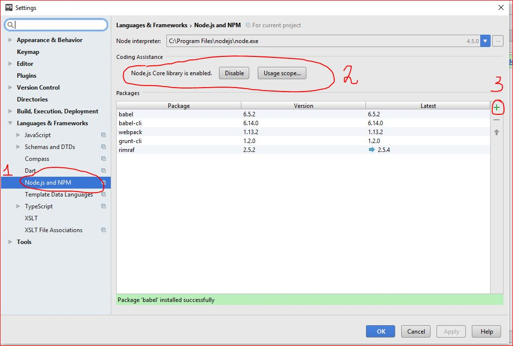

# Интеграция webpack в WebStorm

## Установка пакетов

1) Установите NodeJs [node.js](https://nodejs.org/en/)  
2) Нажмите комбинацию клавиш CTRL+ATL+S. В новом окне перейдите на вкладку Languages&Frameworks -> Node.js & NPM
3) Нажмите кнопку Enable в блоке Coding Assistance
4) Нажмите на символ "+" с права, как показано на рисунке для добавления пакетов.
 

5) Установите пакеты:
```
babel
babel-cli
babel-core
babel-loader
babel-preset-react
babel-preset-es2015
babel-plugin-transform-react-jsx
webpack
react
react-dom

```  

## Конфигурация webpack 

* Конфигурационный файл webpack.config.js следует разместить в директории с приложением. 
```
module.exports = {
    entry: "./main.jsx",
    output:  {filename: '[name].js' },
    module: {
        loaders: [
            {
                test: /\.jsx?$/,
                loader: "babel-loader",
                exclude: /node_modules/,
                query:
                {
                    presets: ["es2015-min", "react"]
                }

            }
        ]
    }
};
```

## Интеграция Webpack в WebStorm IDE 

1) Для интеграции Webpack в WebStorm добавьте следующий код в файл package.json (файл должен находиться в директории с приложением): 
```
 {
  "version": "1.0.0",
  "name": "asp",
  "private": true,
  "scripts": {
    "webpack": "webpack -w"
  },
  "dependencies": {
    "react": "15.3.1",
    "react-dom": "15.3.1"
  },
  "devDependencies": {
    "webpack": "1.13.2",
    "babel": "6.5.2",
    "babel-core": "6.14.0",
    "babel-loader": "6.2.5",
    "babel-preset-es2015-min": "6.14.0",
    "babel-preset-react": "6.11.1",
    "babel-plugin-transform-react-jsx": "6.8.0"
  }
}
``` 

2) Перейдите в пункт меню View, выберите опцию Tool Windows > Project 
‚в открывшемсЯ окне с каталогом папок приложения кликните правой кнопкой мыши по файлу package.json и выберите опцию show npm scripts 

  

3) в открывшемся диалоговом окне npm кликните два раза по опции build: 

 

4) следите за работой webpack в открывшемсЯ терминале: 

 

5) для запуска файла выберите файл и нажмите Ctrl+Shift+F10 

